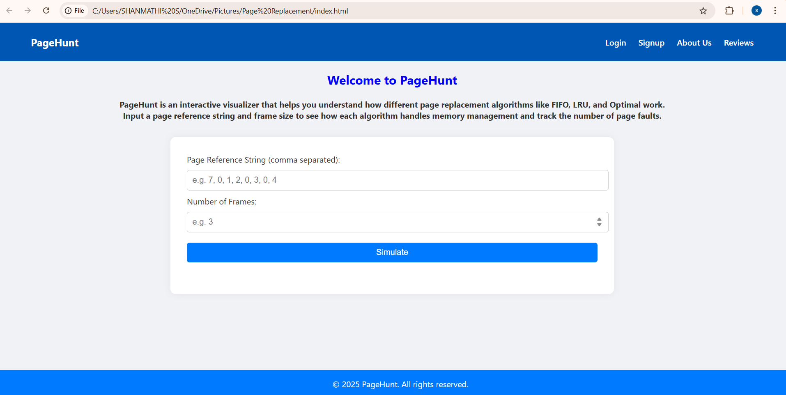

# 🚀 PageHunt - Page Replacement Algorithms Visualizer

**PageHunt** is a dynamic and interactive web application built to simulate and visualize the working of major page replacement algorithms in Operating Systems. It is especially designed for learners, educators, and curious minds who want to understand how memory management and page replacement policies work under the hood.

PageHunt transforms that learning experience into an engaging and hands-on simulation that displays real-time memory allocation, page faults, and replacement steps.

---

##  Page Replacement Algorithm

-  **FIFO (First-In-First-Out)**  
  Removes the oldest page in memory first. Simple and intuitive, but not always optimal.

-  **LRU (Least Recently Used)**  
  Removes the page that hasn’t been used for the longest time. More accurate but requires tracking usage history.

-  **Optimal Page Replacement**  
  Replaces the page that won’t be used for the longest time in the future. Theoretically best but impossible to implement in practice without future knowledge.

---

##  Usage

-  **Real-time Visualization**: Watch as pages are added, replaced, and faults are generated in each frame.
-  **Custom Inputs**: Easily input your own page reference string and choose any frame size to simulate different conditions.
-  **Educational Value**: Excellent for classroom demonstrations, assignments, projects, or self-study.
-  **Fast & Lightweight**: Pure HTML, CSS, and JavaScript—no frameworks or dependencies required.
-  **Attractive & Responsive UI**: Designed for smooth user experience across desktop and mobile devices.

---

##  Preview

---

